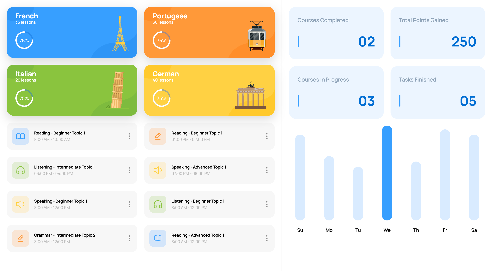

# :books: Web Mini-Course: Creating a Dashboard

### :office: Published by: **[Jagaad Academy](https://academy.jagaad.com/)**

This mini-course present how to create a application dashboard from scratch using Web Technologies. Even those who are not familiar with HTML / CSS / JavaScript, but understand basic programming concepts will be able to reproduce the steps shown in this mini-course. And, with a little more time, you can use the techniques presented to create your own application dashboard.

> Figma project: https://www.figma.com/community/file/1088379718602038121



## Content

The mini-course starts by presenting how to set up the environment (on Macos). Then, it goes through understanding the idea of a web page, HTML / CSS / JavaScript basics, and creating a simple component using HTML / CSS. Finally, we'll move everything to JavaScript land that will allow us to be more dynamic and use all language functionalitties.

<details>
<summary>Curriculum</summary>

- Intro
- Environment Setup
  - Node / NPM / NPX
  - VS Code
- Creating a first page
  - Using simple index.html
  - Starting a local server
- Basics of HTML / CSS / JavaScript
  - HTML Elements structure
  - CSS rules structure
  - Simple browser APIs
- JavaScript variables
  - Strings
  - Numbers
  - Booleans
  - Arrays (set, get)
  - Objects (set, get)
  - No values
  - Operators
- JavaScript Loops
  - for
  - for in
  - for of
  - while
- JavaScript Conditionals
  - if / else
  - switch
- JavaScript Functions
  - Argument Destructuring
- JavaScript Array functions
- JavaScript Modules
- Figma Design
  - Chose Dashboard
  - Design Slicing
  - CSS Normalize
  - Prepare font
  - Add global colors
- Creating Dashboard
  - Middle
    - Big Card
    - Small Card
  - Right
    - Square Card
    - Week Chart

</details>

## Tools

Tools installed at the beginning of the mini-course:

- [Node](https://nodejs.org/): It provides the Node, NPM and NPX executable
- [Visual Studio Code](https://code.visualstudio.com/): The editor that allows to edit code

## Starting the local dev server

```
npx browser-sync --files "**"
```

After development server is started you will be able to view each module in part under this URLs:

- http://localhost:3000/basics
- http://localhost:3000/javascript
- http://localhost:3000/dashboard

## Source code

You can find in this repository the code created in the mini-course:

- [Web Basics](./basics/)
- [JavaScript Basics](./javascript/)
- [Application Dashboard](./dashboard/)

## References

Links for the main contents presented during the mini-course:

- [HTML](https://developer.mozilla.org/en-US/docs/Learn/HTML)
- [CSS](https://developer.mozilla.org/en-US/docs/Learn/CSS)
- [JavaScript](https://developer.mozilla.org/en-US/docs/Learn/JavaScript)
- [Variables](https://developer.mozilla.org/en-US/docs/Learn/JavaScript/First_steps/Variables)
- [Loops and iteration](https://developer.mozilla.org/en-US/docs/Web/JavaScript/Guide/Loops_and_iteration)
- [Conditional statements](https://developer.mozilla.org/en-US/docs/Web/JavaScript/Guide/Control_flow_and_error_handling#conditional_statements)
- [Functions](https://developer.mozilla.org/en-US/docs/Web/JavaScript/Guide/Functions)
- [Modules](https://developer.mozilla.org/en-US/docs/Web/JavaScript/Guide/Modules)


Check out the [Web Developers Network](https://developer.mozilla.org/en-US/) containing more details about each of the functionalities.
